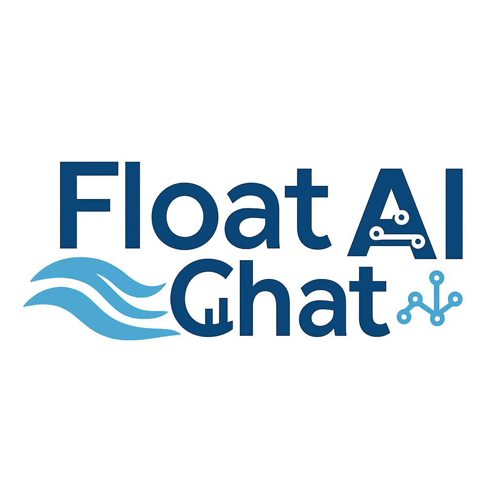

# 🌊 FloatChat - AI-Powered Ocean Intelligence Platform

<div align="center">
  

  **Developed by SYNTAX SQUAD**

  [](https://reactjs.org/)
  [](https://vitejs.dev/)
  [](https://fastapi.tiangolo.com/)
  [](https://python.org/)
  [](https://tailwindcss.com/)
</div>

## 📖 About

FloatChat is a cutting-edge AI-powered ocean intelligence platform that revolutionizes marine data discovery and visualization. Built with modern web technologies and advanced AI capabilities, it provides an intuitive conversational interface for exploring ocean data, marine ecosystems, and maritime intelligence.

Our platform bridges the gap between complex oceanographic data and practical applications for researchers, marine professionals, and coastal communities worldwide.

## ✨ Key Features

### 🎬 Premium User Experience
- **Cinematic Launch Screen**: Professional 5-second intro with progress tracking and premium animations
- **Ocean-Themed UI**: Immersive water backgrounds with glass morphism effects
- **Responsive Design**: Seamless experience across all devices
- **Smooth Animations**: Powered by Framer Motion for fluid interactions

### 🤖 AI-Powered Assistant
- **OceanBot**: Intelligent chatbot specialized in marine and ocean queries
- **Multi-language Support**: Hindi, Tamil, Telugu, Kannada, and English
- **Context-Aware Responses**: Ocean-focused conversations with maritime expertise
- **Session Management**: Persistent conversation history

### 🧭 Core Modules

#### 1. Marine Navigation & Sea Travel Intelligence
- 🗺️ AI-powered GPS navigation and route optimization
- 🌤️ Real-time weather routing and storm warnings
- 🚢 Cargo ship operations and emission reduction
- 🎣 Fishing zone recommendations (PFZ integration)
- ⚓ Coast guard maritime domain awareness
- 🧭 Smart compass with ML corrections

#### 2. Coastal Livelihood & Community Development
- 🐟 Sustainable fisheries management
- 🦐 Aquaculture optimization and monitoring
- 🏖️ Eco-tourism planning and development
- 👥 Community-based conservation initiatives
- 💧 Water quality monitoring for pearl cultivation
- 🧂 Salt production efficiency tracking

#### 3. Marine Research & Ocean Analytics
- 🔬 Advanced oceanographic data collection
- 🐠 Marine biology and species tracking
- 🌡️ Climate impact monitoring and analysis
- 🌿 Biodiversity assessment tools
- 📊 FAIR-compliant data publishing
- 🔗 DOI assignment and citation management

## 🛠️ Tech Stack

### Frontend
- **React 19.1.1** - Modern UI library
- **Vite 7.1.2** - Lightning-fast build tool
- **Tailwind CSS 4.1.13** - Utility-first CSS framework
- **Framer Motion 12.23.12** - Premium animations
- **React Router DOM 7.8.2** - Client-side routing
- **React Icons 5.5.0** - Comprehensive icon library

### Backend
- **FastAPI** - High-performance async Python framework
- **Groq API** - Advanced AI language models
- **Python 3.11+** - Modern Python features
- **Uvicorn** - ASGI server for production
- **Pydantic** - Data validation and serialization

### Deployment
- **Vercel** - Frontend hosting with SPA routing
- **Docker Ready** - Containerized backend deployment

## 🚀 Installation & Setup

### Prerequisites
- **Node.js** (v18 or higher)
- **Python** (3.11 or higher)
- **Git**
- **Groq API Key** (Sign up at [Groq Console](https://console.groq.com/))

### Frontend Setup

1. **Clone the repository**
```bash
git clone https://github.com/yourusername/FloatChat.git
cd FloatChat
```

2. **Install dependencies**
```bash
npm install
```

3. **Start development server**
```bash
npm run dev
```

4. **Access the application**
   - Open [http://localhost:5173](http://localhost:5173) in your browser
   - Enjoy the cinematic launch experience!

### Backend Setup

1. **Navigate to Backend directory**
```bash
cd Backend
```

2. **Create virtual environment**
```bash
python -m venv venv

# Windows
venv\Scripts\activate

# macOS/Linux
source venv/bin/activate
```

3. **Install Python dependencies**
```bash
pip install -r requirements.txt
```

4. **Environment Configuration**
Create a `.env` file in the Backend directory:
```env
GROQ_API_KEY=your_groq_api_key_here
```

5. **Start the FastAPI server**
```bash
python ChatBot.py
```

6. **Access API Documentation**
   - API Docs: [http://localhost:8000/docs](http://localhost:8000/docs)
   - ReDoc: [http://localhost:8000/redoc](http://localhost:8000/redoc)

### Full Stack Development

To run both frontend and backend simultaneously:

1. **Terminal 1 - Frontend**
```bash
npm run dev
```

2. **Terminal 2 - Backend**
```bash
cd Backend
python ChatBot.py
```

## 📱 Application Flow

1. **Launch Experience**: Professional intro with dual logos (FloatChat + SYNTAX SQUAD)
2. **Dashboard**: Hero section with module overview and feature highlights
3. **Module Navigation**: Access specialized marine intelligence tools
4. **AI Assistant**: Interactive chat with OceanBot for expert guidance

## 🔧 Available Scripts

### Frontend Scripts
```bash
npm run dev          # Start development server
npm run build        # Build for production
npm run preview      # Preview production build
npm run lint         # Run ESLint
```

### Backend Scripts
```bash
python ChatBot.py    # Start FastAPI server
pip freeze           # List installed packages
```

## 🌐 API Endpoints

| Endpoint | Method | Description |
|----------|--------|-------------|
| `/chat` | POST | Main chat interface with AI assistant |
| `/platform-info` | GET | Platform information in multiple languages |
| `/languages` | GET | Supported languages list |
| `/session/{id}/history` | GET | Conversation history |
| `/health` | GET | API health check |
| `/models` | GET | Available AI models status |

## 🌍 Multilingual Support

FloatChat supports multiple Indian languages for inclusive accessibility:

- 🇮🇳 **Hindi** (हिंदी)
- 🇮🇳 **Tamil** (தமிழ்)
- 🇮🇳 **Telugu** (తెలుగు)
- 🇮🇳 **Kannada** (ಕನ್ನಡ)
- 🌐 **English**

## 🏗️ Project Structure

```
FloatChat/
├── 📁 Backend/              # FastAPI backend
│   ├── ChatBot.py          # Main server file
│   ├── requirements.txt    # Python dependencies
│   └── .env               # Environment variables
├── 📁 public/              # Static assets
├── 📁 src/                 # React source code
│   ├── 📁 assets/         # Images and media
│   ├── 📁 components/     # Reusable components
│   ├── 📁 Pages/          # Main application pages
│   ├── 📁 Routes/         # React Router configuration
│   ├── App.jsx           # Main app component
│   └── main.jsx          # React entry point
├── package.json           # Node.js dependencies
├── tailwind.config.js     # Tailwind configuration
├── vite.config.js         # Vite configuration
└── vercel.json           # Deployment configuration
```

## 📄 License

This project is licensed under the MIT License. See the [LICENSE](LICENSE) file for details.

## 🏆 Team

**SYNTAX SQUAD** - Passionate developers creating the future of ocean intelligence

## 🔗 Links

- 🌐 **Live Demo**: [floatchat.vercel.app](https://floatchat.vercel.app)
- 📖 **Documentation**: [docs.floatchat.ai](https://docs.floatchat.ai)
- 🐛 **Issues**: [GitHub Issues](https://github.com/yourusername/FloatChat/issues)
- 💬 **Discussions**: [GitHub Discussions](https://github.com/yourusername/FloatChat/discussions)

## 📞 Support

For support and queries:
- 📧 Email: poojapjan22@gmail.com

---

<div align="center">
  <strong>🌊 Dive into the future of ocean intelligence with FloatChat 🌊</strong>
  
  Made with ❤️ by SYNTAX SQUAD - Pooja P
</div>
